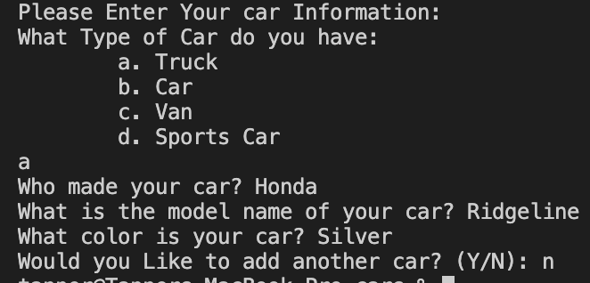
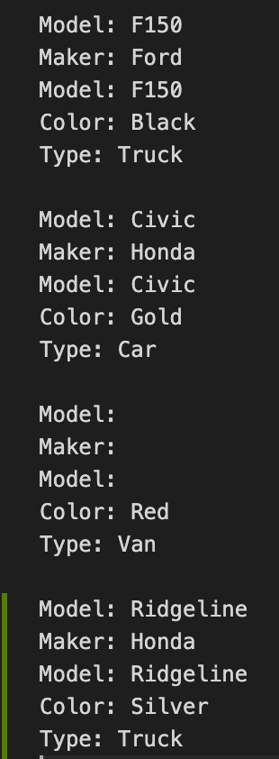

# Personal Car Inventory

## Description:
This program is to help those who have too many cars to count. This program asks the user for a small description of their car and then catagorizes it. After the user is done inputing his cars, the program automatically saves the file to a text file named "carsList.txt". If the file does not exist, the program creates it.

## Execution:
The installation of this program is very simple. Simply download the cars.py file and run the program in your terminal/command prompt. Type python followed by the location and name of the file. The carsList.txt file should be created in the same location as this program.

## Photos:

## Principles Used:
* Variables
* Functions
* Conditionals
* Loops
* Data Structure (list)
* Class
* Flie Transfer

## Useful Websites
* [While Loop W3 Schools](https://www.w3schools.com/python/python_while_loops.asp)
* [Python Classes](https://www.w3schools.com/python/python_classes.asp
)
* [Write to Files](https://www.w3schools.com/python/python_file_write.asp)
* [Python Lists](https://www.w3schools.com/python/python_lists.asp)

If you have any questions, feel free to comment